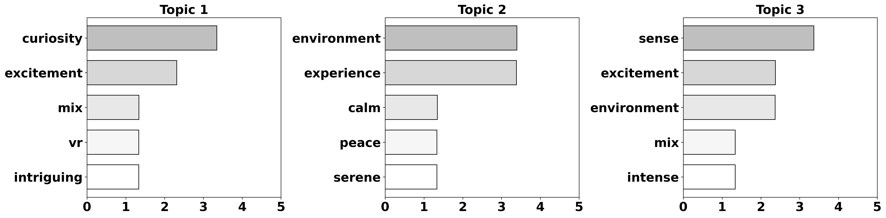
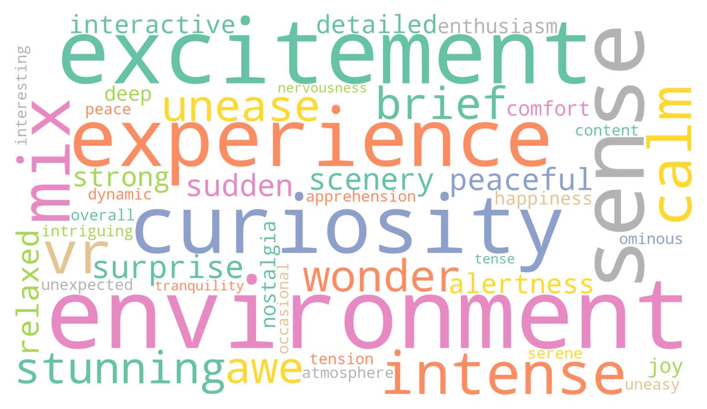

# Topic modeling using Python
This is a sample repository including a simple qualitative analysis based on topic modeling using Python. 

**Note**: If you would like to get more in-depth or nuanced analysis, a more thorough qualitative analysis would be neccessary such as thematic analysis. 


## Quick Start

1. **Install Anaconda:**

   If you haven't installed Anaconda yet, you can download it from the official [Anaconda website](https://www.anaconda.com/products/distribution).

1. **Clone the Repository:**

   First, clone the repository to your local machine:
   ```bash
   git clone https://github.com/HighTemplar-wjiang/topic-modeling-python.git
   cd topic-modeling-python
   ```

1. **Create a Virtual Environment:**

   Open your terminal or command prompt and run the following commands to create and activate a virtual environment using Python 3.8:

   ```bash
   conda create -n topic-modeling python=3.8
   conda activate topic-modeling
   ```

1. **Install the Required Packages:**

   ```bash
   pip install -r requirements.txt
   ```

1. **Launch Jupyter Lab:**
   ```bash
   jupyter lab
   ```

   
   In Jupyter Lab, open the topic_modeling.ipynb notebook located in the _src_ folder and start running the cells to perform topic modeling.


## Topic Modeling Process Explained
The topic modeling uses the following process:

### 1. Data Format
Your dataset should be structured as a `.txt` file, with each data point consisting of three lines:

`participant_id`: A unique identifier for each participant (e.g., `P01`, `P02`, etc.).

`question_id`: A unique identifier for each question (e.g., `Q01`, `Q02`, etc.).

`answer`: The textual response provided by the participant.


Each data point should be followed by a blank line. Please refer to the _src/sample_data.txt_ file as an example.


### 2. Cleaning and Preprocessing
Ensure that your text data is cleaned and preprocessed before running topic modeling. This includes:
- **Expanding Contractions:** Convert shorthanded words like "didn’t" into "did not" to avoid splitting words in the analysis. You can use the `contractions` library in Python for this step.
- **Removing Stop Words:** Exclude common words that do not contribute to the topic analysis (e.g., "the", "and", "is").
- **Lemmatization:** Convert words to their base forms (e.g., "running" to "run").

### 3. Additional Stop Words
You may want to define additional stop words that are specific to your dataset or analysis. These can be passed into the topic modeling function as `additional_stop_words`.

### 4. Saving and Organizing Figures
Ensure that your figures directory is properly set up. The `figure_path` variable should point to a directory where all generated figures, such as word clouds and topic distributions, will be saved (default: `../figures`). 

### 5. Key Parameters to Adjust
When performing topic modeling, two key parameters can significantly impact the results:

- **`n_topics (default:3)`**: This parameter defines the number of topics that the model should extract from the data. You can adjust this value based on the diversity and volume of your text data. Increasing the number of topics can provide more granular insights, but it may also introduce noise.

- **`n_top_words (default:5)`**: This parameter specifies the number of top words to display for each topic. These words are the most representative of the topic. Adjusting this number can help focus the analysis on the most critical keywords or broaden it to include more terms that contribute to each topic.

- **`additional_stop_words`**: This parameter allows you to define a custom list of stop words that are specific to your dataset. These are words that should be ignored during the analysis because they do not contribute to the meaning of the topics (e.g., domain-specific terms, common phrases, or words that are not relevant to the analysis). Adding relevant stop words can help improve the clarity and relevance of the extracted topics.

By fine-tuning these parameters, you can optimize the topic modeling results to suit your specific analysis needs.

### Example output:

**Topics and weights:**

```
Topic 1 and its weights:
[('curiosity', 3.3475659165615212), ('excitement', 2.3115839733546646), ('mix', 1.3364017570066764), ('vr', 1.33343130592172), ('intriguing', 1.3327031531347717)]

Topic 2 and its weights:
[('environment', 3.395497853722327), ('experience', 3.3854935095935583), ('calm', 1.3455740769787092), ('peace', 1.3327585147329994), ('serene', 1.3327585147329994)]

Topic 3 and its weights:
[('sense', 3.3662384535157455), ('excitement', 2.375290103295279), ('environment', 2.3673739366056488), ('mix', 1.3395480958274038), ('intense', 1.3384944453639704)]
```

**Topic Modeling Visualization for Q01:**


**Word Cloud Visualization for Q01:**



## Next Steps
Based on the topic modeling results, you may need to:

1. **Refine the Number of Topics (`n_topics`)**: After reviewing the initial results, consider adjusting the number of topics to better capture the distinct themes in your data. If the topics are too broad, try increasing `n_topics`. If they are too fragmented, decrease it.

1. **Review and Adjust Stop Words (`additional_stop_words`)**: Analyze the top words within each topic to identify any irrelevant or overly common words that may have slipped through. Add these to your `additional_stop_words` list and rerun the analysis for cleaner results.

1. **Interpret and Label Topics**: Once you are satisfied with the topics, carefully review the top words for each topic and assign descriptive labels. These labels will help communicate the themes identified in your data.

1. **Visualize Key Findings**: Use the generated figures, such as word clouds and topic distributions, to highlight the most important topics. Consider creating summary visualizations that combine insights across questions or participant groups.

1. **Iterate on Data Preprocessing**: If the topics still contain noise or irrelevant information, you may need to revisit your preprocessing steps. Consider further cleaning the data, expanding contractions, or even lemmatizing terms more aggressively.

1. **Apply Insights**: Use the labeled topics and visualizations to inform your research, decision-making, or further analysis. The insights gained from topic modeling can guide future surveys, product development, or content creation strategies.

By following these steps, you can ensure that your topic modeling results are meaningful, actionable, and aligned with your objectives.


## References
The topic modeling process is used in some of my previous publications, if you found this repository useful, it would be great if you can cite our work:

```
@article{jiang2024mobile,
    author = {Jiang, Weiwei and Goncalves, Jorge and Kostakos, Vassilis},
    journal = {ACM Computing Surveys},
    title = {Mobile Near-infrared Sensing—A Systematic Review on Devices, Data, Modeling, and Applications},
    year = {2024},
    issue_date = {August 2024},
    publisher = {Association for Computing Machinery},
    address = {New York, NY, USA},
    volume = {56},
    number = {8},
    issn = {0360-0300},
    url = {https://doi.org/10.1145/3652596},
    doi = {10.1145/3652596},
    month = {apr},
    articleno = {201},
    numpages = {36},
    keywords = {Mobile computing, near-infrared, mobile sensing, data, machine learning}
}

@article{jiang2024immersive,
    author = {Jiang, Weiwei and Windl, Maximiliane and Tag, Benjamin and Sarsenbayeva, Zhanna and Mayer, Sven},
    journal = {IEEE Transactions on Visualization &amp; Computer Graphics},
    title = {An Immersive and Interactive VR Dataset to Elicit Emotions},
    year = {2024},
    volume = {},
    number = {},
    issn = {},
    pages = {1-11},
    doi = {},
    publisher = {IEEE Computer Society},
    address = {Los Alamitos, CA, USA},
    month = {},
    note = {(Just accepted)}
}
```


*(_Discrimination: This read me and sample data were partially generated by ChatGPT-4o._)

